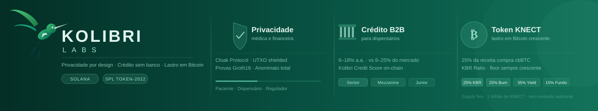
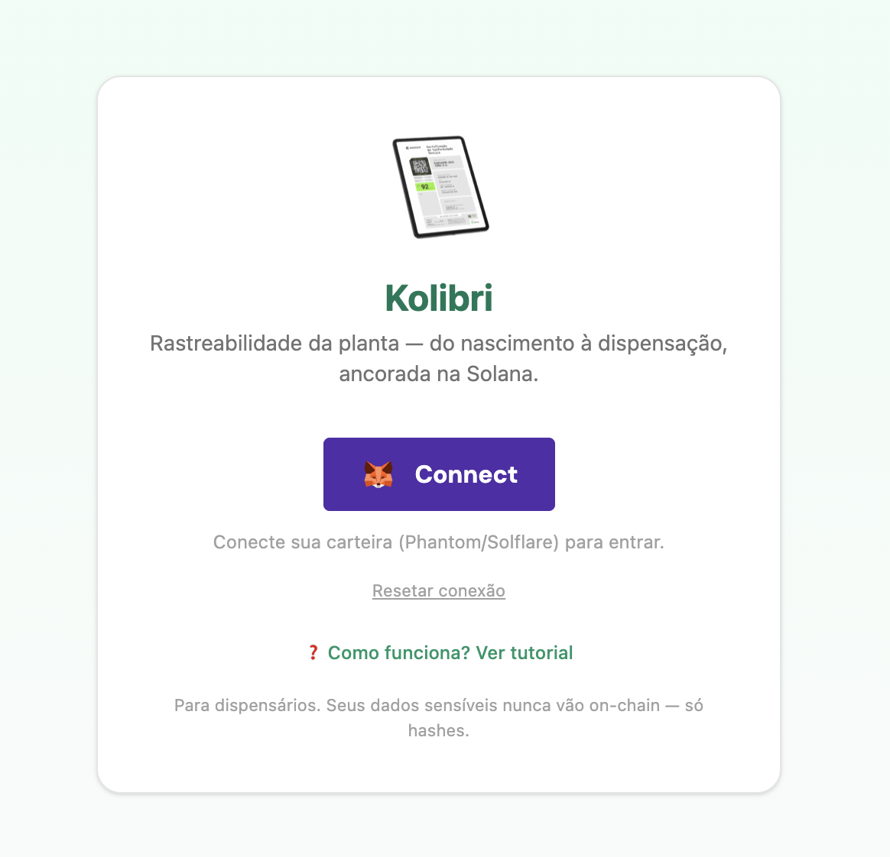
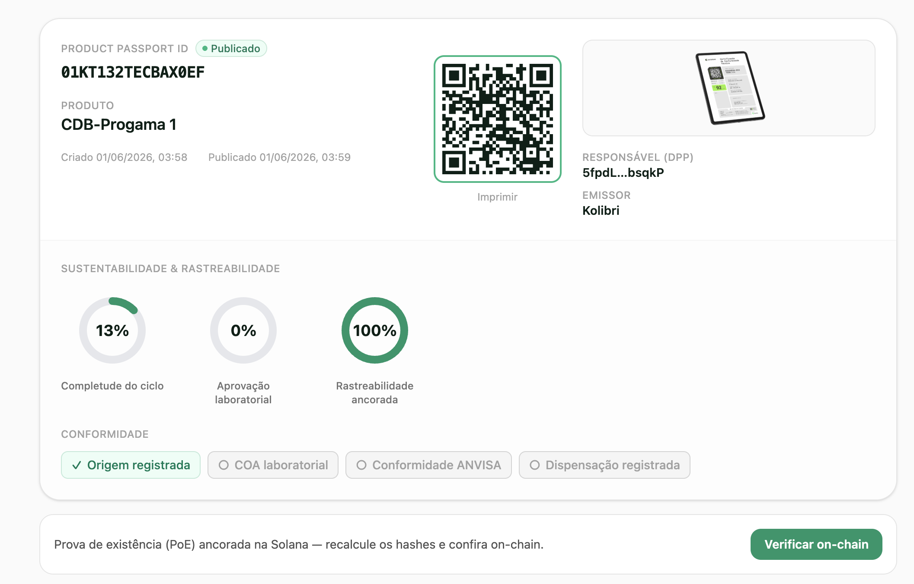

# Kolibri - [LINK DO PROJETO](https://kolibri-web.onrender.com)

**Rastreabilidade de ponta a ponta para cannabis medicinal — com Proof-of-Existence verificável na Solana.**

Kolibri é uma plataforma vertical de **gestão e compliance** para dispensários e associações de cannabis medicinal no Brasil (LGPD + ANVISA RDC 1.015/2026 + SNGPC), sobre três pilares: **rastreabilidade imutável**, **privacidade por design** e **eficiência operacional**.

Este repositório entrega o **núcleo de rastreabilidade + Proof-of-Existence**: cada evento — do nascimento da planta à dispensação ao paciente — é registrado de forma **verificável e à prova de adulteração** na Solana, sem nunca expor dados sensíveis.

> Trilha **Solana** · Hackanation 2026 (TokenNation) · **Repo:** https://github.com/pedro-pelicioni/kolibri

---

## 🔐 Proof-of-Existence (PoE) — o que é e por quê

Cada evento crítico (registro de origem, ato dispensador, recall…) gera um **commitment criptográfico** — o `sha256` do payload canônico — **ancorado on-chain** na Solana. O dado completo (com PII) fica **off-chain e cifrado**; on-chain trafega **só o hash + a referência de storage**.

Três garantias:
1. **Imutável & à prova de adulteração** — o registro on-chain é permanente; ninguém reescreve o histórico depois (nem o próprio dispensário).
2. **Auditável publicamente** — a ANVISA (ou qualquer um) recomputa o `sha256` do payload e confere contra o hash on-chain, direto no explorer — procedência provada **sem confiar no operador**.
3. **Privacidade preservada** — como só o hash vai on-chain, nenhum dado de paciente (CPF/CNS/nome) é exposto.

É o que o passaporte público faz no botão **"Verificar on-chain"**: recomputa o hash no navegador e confere com a blockchain.

---

## 📸 Screenshots

| Home | Passaporte público (DPP) verificável on-chain |
|:---:|:---:|
|  |  |

---

## ✅ Requisitos do Hackanation 2026 — status

| Requisito (regras) | Status |
|---|---|
| **Programa/Smart contract on-chain** (Solana, pode ser testnet/devnet, data após o início) | ✅ `kolibri_registry` publicado na **devnet** (deploy em jun/2026) |
| **Endereço público do contrato** | ✅ [`Bybi3nTRCF1CU15BvwLnMA4B27YGs5BuoVXeFzFxfqnF`](https://explorer.solana.com/address/Bybi3nTRCF1CU15BvwLnMA4B27YGs5BuoVXeFzFxfqnF?cluster=devnet) |
| **Contrato verificado em explorador público** | ✅ **build verificável** (bate byte-a-byte com o repo público) + **PDA de verificação on-chain** |
| **Código em um único repositório GitHub público** (contracts + back-end + frontend) | ✅ este monorepo — `programs/` + `apps/api` + `apps/web` |
| **Frontend com link público** (opcional, agrega valor) | ✅ **no ar no Render** (API + Postgres + web) |
| **Projeto publicado na Taikai** (não-draft) | ✅ trilha Solana, visível a todos |
| **Vídeo 3–4 min (YouTube)** | ✅ [video do pitch - feito pelo CEO Vitor Emanuel](https://youtu.be/7TKv1oENYjc?si=Of9uJ93uEouD0crd) |
| **Pitch + transação ao vivo** | ✅ "Registrar planta" no app **É** a transação demonstrável (ancora + minta on-chain) |

---

## 🔗 Provas on-chain (devnet) — clique e confira

| O quê | Solana Explorer |
|---|---|
| **Programa** (`Executable: true`, verificado) | [`Bybi3n…fqnF`](https://explorer.solana.com/address/Bybi3nTRCF1CU15BvwLnMA4B27YGs5BuoVXeFzFxfqnF?cluster=devnet) |
| **Tx do deploy** | [`56Vx…459s`](https://explorer.solana.com/tx/56Vx4J8BjTpYv5EUr6mpdL9kfj3ju6PGsG85t6cPz56ocwboWEx21KGpHXKXvTQpAAMbUnHxHUkPwZqL8BYj459s?cluster=devnet) |
| **Tx do PDA de verificação** | [`5to6…P2MA`](https://explorer.solana.com/tx/5to6nuP5KVbxUaoUPFPHPRUMXG5WnVmtgRGRc9zDRZyAR9KW88JYqpGcccx61moytvsv3xmoja2iuQe2HmZFP2MA?cluster=devnet) |
| **NFT de uma planta** (Metaplex Core) | [`Dd9t…nE5b`](https://explorer.solana.com/address/Dd9tExQ6NNokv83pbndRFGTJTHbVPWzuUo26vFYYnE5b?cluster=devnet) |
| **PDA de uma planta** (prova PoE) | [`DHYz…MWY9`](https://explorer.solana.com/address/DHYzh6bZkShtyq2eLE48hBmSJyPXmhNWbBLgpmkcMWY9?cluster=devnet) |

Todas as transações têm data posterior ao início do hackathon. O programa é **upgradeable** (authority pública) e tem **build verificável** (bytecode on-chain = código deste repo).

---

## O que está implementado

Este repositório é o **núcleo de rastreabilidade on-chain** do Kolibri (o pilar "rastreabilidade imutável" da visão de produto):

- **Auth de dispensário** via Sign-In With Solana (SIWS) + JWT.
- **Registro da planta** (origem/genética) → cria um `Batch` PDA on-chain + minta um **NFT Metaplex Core** (o certificado).
- **Eventos do ciclo de vida** (15 tipos: do plantio à dispensação) — cada um ancora `sha256(payload canônico)` on-chain. PII (CPF/CNS) **nunca** vai on-chain — só `sha256(valor)`, hasheado no navegador.
- **Passaporte público** (`/passport/:id`, alvo de QR) no padrão **Digital Product Passport (DPP)**: cartão + gauges + selos de compliance + abas + NFT + **"Verificar on-chain"** (recomputa o sha256 no navegador e confere a conta `Batch`).
- **Ancoragem server-custody**: o backend assina/paga (1 clique, sem popup por evento); o SIWS + o NFT amarram a identidade do dispensário.

---

## Arquitetura (monorepo pnpm + Turborepo)

```
kolibri/
├─ apps/
│  ├─ web/        # Vite + React + Tailwind v4 + wallet-adapter (SIWS) — dashboard, forms, passaporte
│  └─ api/        # Fastify + Prisma + Postgres — SIWS, canonical-JSON+sha256, worker de ancoragem
├─ packages/
│  ├─ types/      # @kolibri/types — 15 eventos (zod) + DTOs
│  ├─ sdk/        # @kolibri/sdk — canonicalize, sha256, ULID↔16b, client do programa, mappers do passaporte
│  └─ ui/         # @kolibri/ui — utilitários de UI
├─ programs/      # workspace Anchor/Rust (ISOLADO do pnpm)
│  └─ programs/kolibri-registry/   # programa Solana
├─ render.yaml    # blueprint de deploy (API + Postgres + web)
└─ docs/          # schemas dos 15 eventos (event-schemas.md é a fonte canônica)
```

**Programa Solana `kolibri_registry`** (Anchor 0.32.1, devnet — `Bybi3n…fqnF`):

| Instrução | O que faz |
|---|---|
| `register_plant(batch_id, dispensary, origin_event_type, origin_hash, storage_uri)` | Cria o PDA `Batch` (seeds `["batch", dispensary, batch_id]`), ancora o hash de origem (raiz PoE). |
| `record_event(event_type, payload_hash, storage_uri)` | Ancora o `sha256(payload)` de um evento; guarda o hash do último + contagem; emite `EventRecorded`. |
| `set_asset(asset)` | Vincula o NFT Metaplex Core (mintado off-chain via umi) ao lote. |

---
## 🗺️ Roadmap — próximas fases

O MVP deste repo entrega a **rastreabilidade + PoE**. As próximas fases (após validação operacional com 2–3 dispensários âncora):

**Produto & infraestrutura**
- **Mainnet** — programa em produção na Solana mainnet (+ selo *Verified* no Solscan, que é mainnet-only).
- **ERP com privacidade por design** — dados sensíveis do paciente (nome, CPF, endereço, histórico) cifrados em coluna no Postgres com **AES-256**, chave dedicada por dispensário via **AWS KMS**. Módulo fiscal (NF-e) roda em **rede isolada** do sistema operacional — os dois nunca se tocam.
- **NF-e + SNGPC automatizados** — escrituração SNGPC em até 24h (com retry + alerta ao farmacêutico RT); NF-e em segundos.
- **Pagamentos confidenciais via Cloak Protocol** — transferências *shielded* com provas ZK (Groth16) na Solana: nem o valor nem as contrapartes ficam visíveis on-chain. O dispensário recebe, o paciente paga — ninguém mais vê.
- **App nativo** — aplicativo mobile para a dispensação em balcão.

**Token & DeFi — TGE previsto para nov/2026**
- **Token KNECT** (SPL Token-2022) — utility token com **lastro em Bitcoin crescente** (25% da receita compra cbBTC), supply fixo de **1 bilhão**, sem emissão adicional (split 25% KBR / 25% burn / 35% yield / 15% fundo).
- **Kolibri Credit Pool** — crédito DeFi B2B para dispensários usando o **histórico on-chain como score** (Kolibri Credit Score), em tranches Senior/Mezzanine/Junior, **6–18% a.a.** (vs 8–25% do mercado).
- TGE quando os dispensários âncora já estiverem em produção com dados reais.

---

## Decisões & escopo

- **Server-custody** na ancoragem (UX de demo + confiabilidade); identidade via SIWS + NFT.
- **NFT mintado pela API (umi)** + vinculado on-chain por `set_asset` — robusto, sem CPI Rust frágil.
- **Anchor 0.32.1** 
- PoE com **sha256** (canonical JSON estilo JCS); PII sempre como hash. Storage de uploads local no MVP (IPFS/Shadow são evolução).
- **Fora deste MVP** (ver Roadmap acima): mainnet, Cloak (pagamentos shielded), NF-e/SNGPC, app nativo, token KNECT + Credit Pool.

## Status técnico

| Componente | Estado |
|---|---|
| Programa `kolibri_registry` | ✅ build + 5/5 testes + **deploy + verificado na devnet** |
| API (SIWS, CRUD, worker, passaporte, verify) | ✅ E2E validado na devnet (NFT minta + sha256 confere 3/3) |
| Web (login, dashboard, forms, passaporte DPP + verify) | ✅ builda + renderiza com dados reais |
| Deploy nuvem (Render) | ✅ API + Postgres + web no ar (blueprint `render.yaml`) |

> Docs dos 15 eventos: [`docs/event-schemas.md`](./docs/event-schemas.md). Arquitetura mobile anterior ao pivô: `HANDOFF.md`/`docs/MOBILE.md` (legado).
